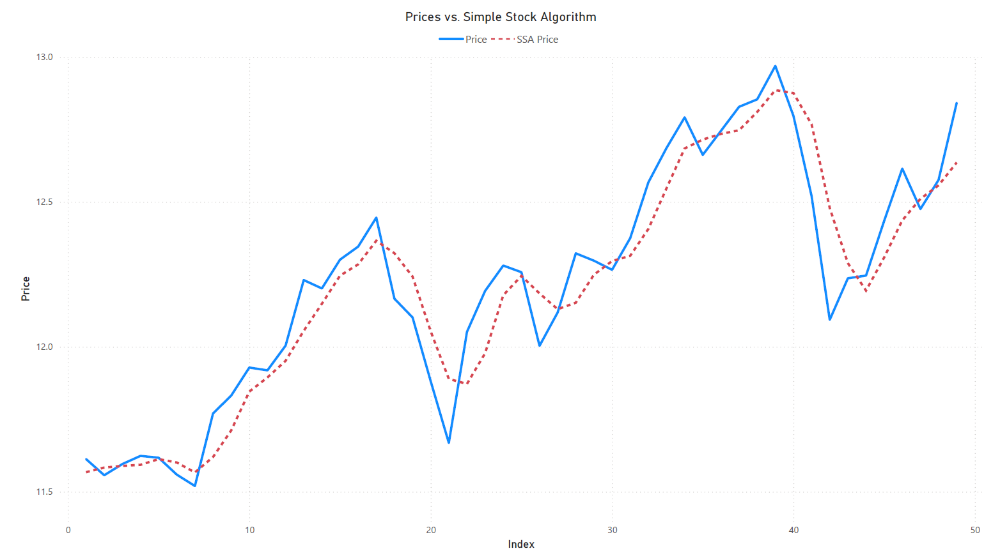
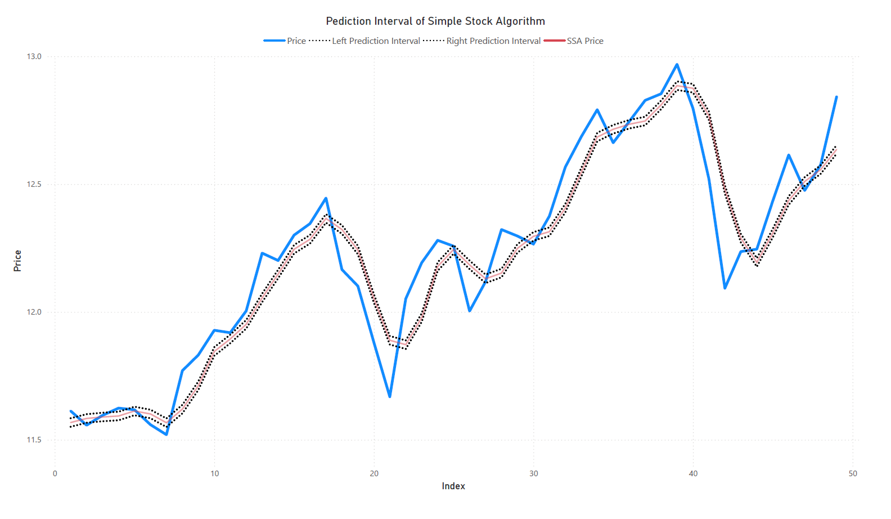

# Simple Stock Algorithm
The Simple Stock Algorithm is a prediction algorithm utilizing the three-day moving average and a coefficient $\omega$ multiplied by the three-day moving standard deviation. The equation is: **$$p(t) = \mu_{3}(t)+\omega\sigma_{3}(t)$$**. Using gradient descent to optimize the coefficient $\omega$, we will be able to minimize the mean squared error of the residuals of the model. We will be using R for the implimentation of this algorithm. The graph below shows the results: 
 

# Choosing the Equation and Optimizing the Coefficient $\omega$
The objective of this project is to choose a simple, easy to emplement algorithm that only needs the input of the stock price. There are several several other possible models that could have been used, however a model based on the moving average allows for a predicted price that will remain relatively close to the previous price. By doing so, we will create a sort of 'smoothing' function. This will also aide in resistance of spikes and dips in the price that do not reflect the overall trend.
To optimize $\omega$ we use the gradient descent algorithm. The html file for the simple stock algorithm gives an explanation of the gradient descent algorithm and the reason we use it here.

# Insights and Conclusions
Graph of SSA Prediction Interval 
 

While the model does an excelent job detecting trends and ignoring sudden price changes that do not reflect these trends, the prediction capabilities of the algorithm leave much to be desired **(see graph above)**. The mean squared error of the algrithm with $\omega = 1$ was **$0.03064407$**, while the mean squared error of the algorithm with the optimized $\omega$ was **$0.01684353$**. To create a better model, it would be necessary to observe the error of the SSA vs. the price and run a machine learning algorithm perhaps a **gradient booster** algorithm to predict the error. This will perhaps yield a better mean squared error and a more generalized model. This could also lead to overfitting, especially if outliers are not handled correctly. 

# Other Repo Files
**<ins>SSA - SimpleStockAlgo.R</ins>**: Original file containing the slgorithm function and implimentation examples. 
**<ins>SSA - Directional Accuracy.R</ins>**: Contains a directional accuracy test where, we assess the model's prediction of price changes 
**<ins>SSA - DirectionalAccuracyConvergenceTest.R</ins>**: Convergence test to see if directional acuracy percentage can become consistent when the window of the algorithm is increased.
**<ins>SSA - SSA.ipynb</ins>**: Simple Stock Algorithm written in Python.
