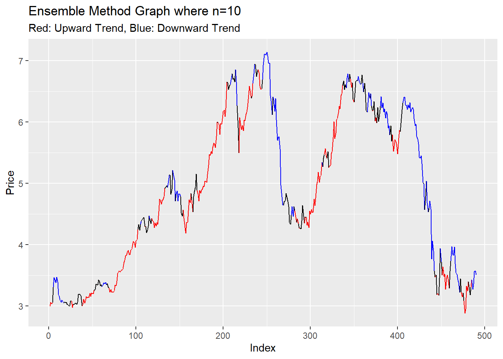

# Trend Detection

In this project I used a custom trend detector $\tau$ and the regression coefficient $\beta$ to mark the upward and downward trends in time series. For this project, I used the apple stock price data. This project was done in the R programming language. For the entire project go to the .rmd file in AdditionalFiles in this repo, for the raw code, download the above file TrendDetection.R.

# Methodology

The custom trend detector $\tau$ is defined as the normalized mean of the price differences over a time period $n$. Mathematically: 
 
$\tau=\frac{\sum(y_{n-1}-y_n)}{n} \cdot \frac{1}{\sigma(y_1,...,y_n)}$ 
 
**Note:**  $\frac{1}{\sigma(y_1,...,y_n)}$  is the normalization term. 
 
To assess the validity of $\tau$ we use the following hypothesis test: 
 
$H_0:\tau = 0$ 
$H_a:\tau \neq 0$ 
 
Recall the hypothesis test for a regression equation $\hat{y_i}=\beta_0+\beta_1x_i+\epsilon$ 
 
$H_0:\beta_i=0$ 
$H_a:\beta_i \neq 0$ 
 
**Note:** The direction and significance will be assesed on $\beta_1$ 
 
Since $\tau$ represents a normalized mean, we can use a two sided t-test where $\alpha=0.05$ to detect statistical significance in $\tau$. An upward/downward movement (**trend**) will be considered when we reject both null hypotheses of $\tau$ and $\beta$ and $\tau$ and $\beta$ have the same direction, while we will consider **no trend** when we fail to reject either hypothesis **or** $\tau$ and $\beta$ have different directions. 
 
# Output and Conclusions

The ensemble method for $n<10$ shows inconsistent trend detection during steady rises and falls in price. When $n=10$, we see a better detection of trends while smaller rises and dips in price are treated as "no trend". This is done through the regression coefficient test since it is less susceptible to volatility in the same range. This model does have issues and could use other indicators of trends including one dedicated to volatility and one dedicated to momentum. While the addition of regression aids in robustness against volitility, accounting for relative volatility using weights could add further robustness to the model by not allowing large swings in price pull $\tau$ in a direction that is not indicative of the larger trend.
