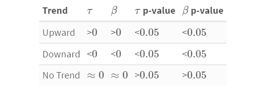

# Trend Detection

In this project I used a custom trend detector $\tau$ and the regression coefficient $\beta$ to mark the upward and downward trends in time series. For this project, I used the apple stock price data.

# Methodology

The custom trend detector $\tau$ is defined as: 
 
$\tau=\frac{\sum(y_{n-1}-y_n)}{n} \cdot \frac{1}{\sigma(y_1,...,y_n)}$ 
 
To assess the validity of $\tau$ we used the following hypothesis test: 
 
$H_0:\tau = 0$ 
$H_a:\tau \neq 0$ 
 
An upward/downward movement (**trend**) will be considered when we reject both null hypotheses of $\tau$ and $\beta$, while we will consider **no trend** when we fail to reject either hypothesis. 
 
<ins>Trends:</ins> 

# Output and Conclusions

The ensemble method for $n<10$ shows inconsistent trend detection during steady rises and falls in price. When $n=10$, we see a better detection of trends while many small rises and falls in price are treated as "no trend". This is done through the regression coefficient test since it is less susceptible to volatility in the same range. This model does have issues and could use other indicators of trends including one dedicated volatility and one dedicated to momentum. Accounting for relative volatility could add robustness to the model by not allowing large swings in price pull $\tau$ in a direction that is not indicative of the larger trend.
